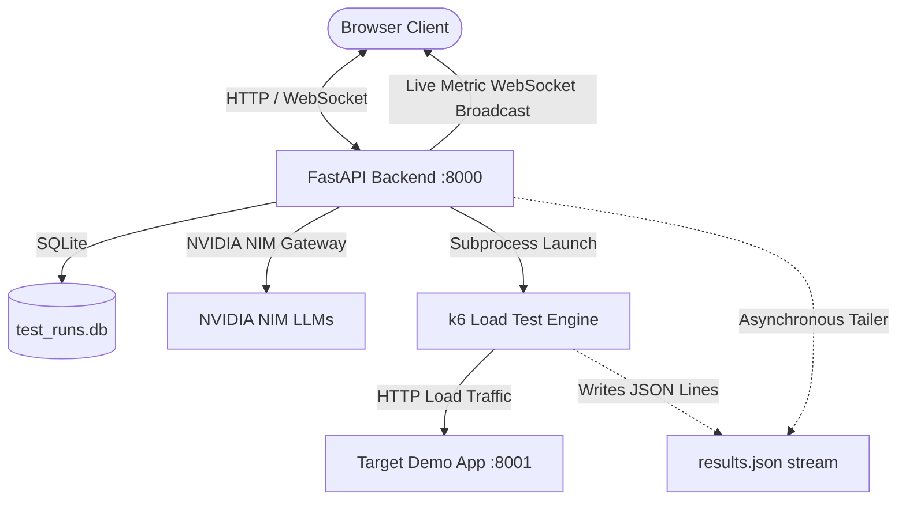

# AutoPerf: AI-Powered Autonomous Performance Testing Platform

AutoPerf is an autonomous, end-to-end performance engineering platform that translates natural-language test prompts into structured test intent, generates realistic synthetic payloads, synthesizes verified k6 load-testing scripts, executes real load tests, streams telemetry to a live dashboard, and diagnoses system bottlenecks using AI-driven root-cause analysis.

---

## Architecture Overview



### Core Pipeline Capabilities
1. **Merged Intent & Synthetic Payloads**: A single structured LLM call extracts test configuration (test type: `baseline`, `soak`, `stress`, virtual users, duration, ramp stages, threshold criteria) and generates realistic mock payloads while documenting all default assumptions.
2. **k6 Script Synthesis & Self-Healing Smoke Validation**: Generates valid ES6 k6 test scripts with strict few-shot templates, validates each script with a 2-second smoke run (`k6 run --duration 2s --vus 1 --no-thresholds <script>`), and self-heals syntax or runtime errors automatically.
3. **Dual-Mode Execution Architecture**: Auto-detects whether the Docker daemon is active. If Docker is absent, it automatically routes execution to local standalone `k6.exe` targeting `http://127.0.0.1:8001`.
4. **Real-Time Streaming Metrics & Dashboard**: Tails `results.json` in real time, aggregating throughput, error rates, p50/p95/p99 latencies, and active VUs, streaming updates every 500ms over WebSocket (with HTTP polling fallback).
5. **AI Post-Run Root Cause Diagnostic Report**: Sends final test metrics to an LLM to generate a structured 4-section performance report: **Verdict**, **What Happened**, **Root Cause Analysis**, and **Actionable Recommendations**.
6. **Persistence & Run History**: Stores all runs, intents, scripts, and metrics in SQLite with instant history replay.
7. **Offline Demo Fixtures**: Pre-packages full run artifacts in `fixtures/` for offline demonstrations.

---

## Target Demo Application (`:8001`)

The target application simulates real-world backend microservice behaviors:
* `GET /api/fast`: Instant healthy baseline (< 5ms response time).
* `GET /api/delayed`: Realistic simulated latency (150ms - 400ms).
* `POST /api/heavy`: Concurrency-sensitive endpoint. Normal responses process in 80ms - 140ms. When concurrent in-flight requests exceed the breaking threshold (`BREAKING_POINT_CONCURRENCY = 50`), it simulates thread-pool starvation and database connection pool exhaustion, triggering HTTP 503 Service Unavailable errors.

---

## Quick Start (Local Native Execution)

### Prerequisites
* Python 3.11+
* k6 binary (pre-installed in `tools/bin/k6.exe`)
* NVIDIA NIM API key (from [build.nvidia.com](https://build.nvidia.com/))

### 1. Environment Setup
```bash
# Clone the repository
git clone <repo-url>
cd hackthon

# Create and activate virtual environment
uv venv .venv
.venv\Scripts\activate

# Install dependencies
uv pip install -r requirements.txt
```

### 2. Configure Environment Variables
Copy `.env.example` to `.env` and set your NVIDIA NIM API key:
```ini
NVIDIA_API_KEY=nvapi-...
NVIDIA_BASE_URL=https://integrate.api.nvidia.com/v1

# Models verified on NVIDIA NIM
MODEL_FAST=meta/llama-3.2-11b-vision-instruct
MODEL_CODE=meta/llama-3.2-11b-vision-instruct

BACKEND_PORT=8000
TARGET_APP_PORT=8001
TARGET_APP_URL=http://target-app:8001
LOCAL_TARGET_APP_URL=http://127.0.0.1:8001
```

### 3. Launch Services
Start the Target Demo App on port 8001:
```bash
python -m uvicorn target_app.main:app --port 8001 --host 127.0.0.1
```

In a separate terminal, start the Backend Platform on port 8000:
```bash
python -m uvicorn backend.app.main:app --port 8000 --host 127.0.0.1
```

Open your browser at:
```
http://127.0.0.1:8000/
```

---

## Automated Verification & Test Suite

Run the full end-to-end test suite:
```bash
# Step 2: Target App & Deliberate Breaking Point verification
python tests/test_step2_target_app.py

# Step 3: Locked Intent JSON Schema validation
python tests/test_step3_schema.py

# Step 4: Merged Intent & Synthetic Payload generation (10 diverse prompts)
python tests/test_step4_intent_payload.py

# Dual-Mode Docker detection & URL normalization
python tests/test_docker_dual_mode.py

# Step 12 & 13: End-to-End verification across all 3 test types (Baseline, Soak, Stress)
python tests/test_step12_e2e_all_types.py
```

---

## Known Limitations & Host Environment Notes

1. **Docker Execution Branch (Code-Audited, Unverified Live)**:
   * The repository includes complete Docker configurations (`docker-compose.yml`, `backend/Dockerfile`, `target_app/Dockerfile`, network isolation `perf-net`).
   * Because Docker was not installed on the primary demonstration host, the Docker containerized path (`docker run --network perf-net grafana/k6 ...`) is **code-audited but unverified by live execution**.
   * **Sole Live Demo Path**: The platform defaults to and proceeds with the **Native Standalone `k6.exe`** execution path. The built-in runtime detection in `backend/app/services/docker_utils.py` automatically detects Docker's absence and routes traffic to native IPv4 loopback (`http://127.0.0.1:8001`) with zero manual configuration required.
2. **NVIDIA NIM API Rate Limits**:
   * The NVIDIA NIM free tier operates with a shared quota (~40 requests/minute).
   * To prevent HTTP 429 throttling, the platform enforces exponential backoff with jitter and introduces automated 1.8s pacing between batch LLM calls.
3. **Windows Loopback Resolution**:
   * On Windows hosts, `localhost` can occasionally resolve to IPv6 `[::1]`, while local Python servers bind to IPv4 (`127.0.0.1`). The platform automatically normalizes all local host references to explicit IPv4 loopback (`http://127.0.0.1:8001`) to eliminate connection latency.
4. **Offline Demo Fallback**:
   * Complete pre-recorded run artifacts are saved in `fixtures/` (`sample_intent.json`, `sample_payloads.json`, `sample_script.js`, `sample_results.json`, `sample_summary.md`), ensuring full demonstration capability even in network-isolated environments.
